# URL Search Tool

## Table of Contents

1. [Introduction](#Introduction)
2. [Getting Started](#Getting-Started)
3. [Wireframe](#Wireframe)
4. [Use Case Diagram](#Use-Case-Diagram)
5. [Technologies](#Technologies)
6. [System Design](#System-Design)
7. [Entity Relational Diagram](#Entity-Relational-Diagram)
8. [Database Schema](#Database-Schema)
9. [Dataset](#Dataset)
10. [Algorithm](#Algorithm)
11. [Demo](#Demo)
12. [Presentation Slides](#Presentation-Slides)
13. [Contributors](#Contributors)

## Introduction

Given any URL on the internet (mostly text-based website), the system saves the content and its context and retrieves such records.

The system parses the content into (English) words, removing [stop words](https://whatis.techtarget.com/definition/stop-word). Words that carry explicit meaning are stored into the database.
This application allows users to query for URLS given a set of keywords.

Examples:
“Give the user URLs that contain W+ where W+ is one or more words”
“Give the user concurrent words given W -- if W occurs then a W also occurs with a certain probability.

## Getting Started

- Set up AWS account
- Set up lambdas
- Configure config.js in src
- `npm install & start`

## WireFrame

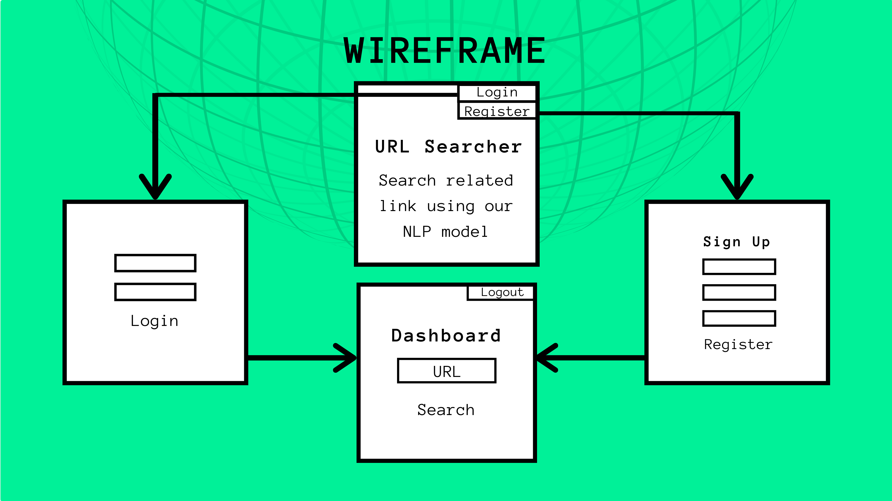

## Use Case Diagram

## Technologies

__Frontend__
- React
- React-Bootstrap
- AWS Amplify
- AWS S3 + CloudFront

__Backend__
- AWS API Gateway
- AWS Cognito
- AWS Lambda Function
- AWS RDS (MySQL)
- News Article API

## System Design

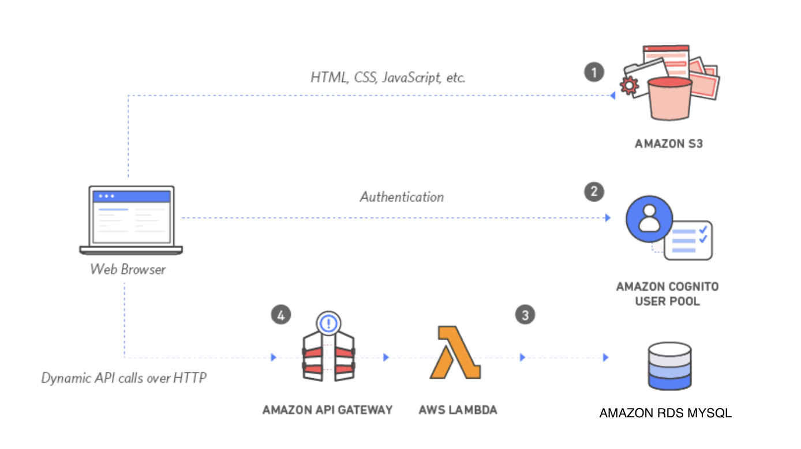

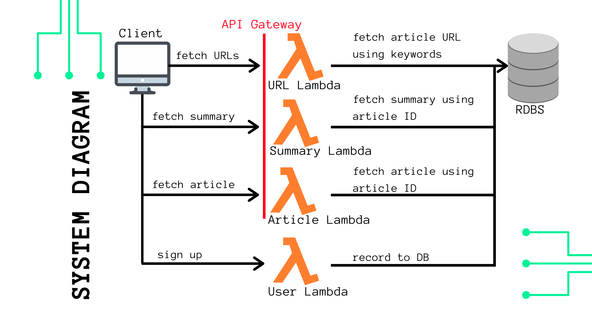s

## Entity Relational Diagram

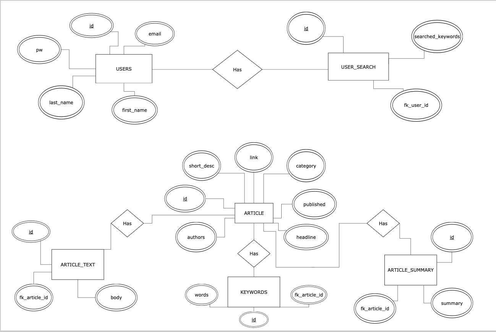

## Database Schema

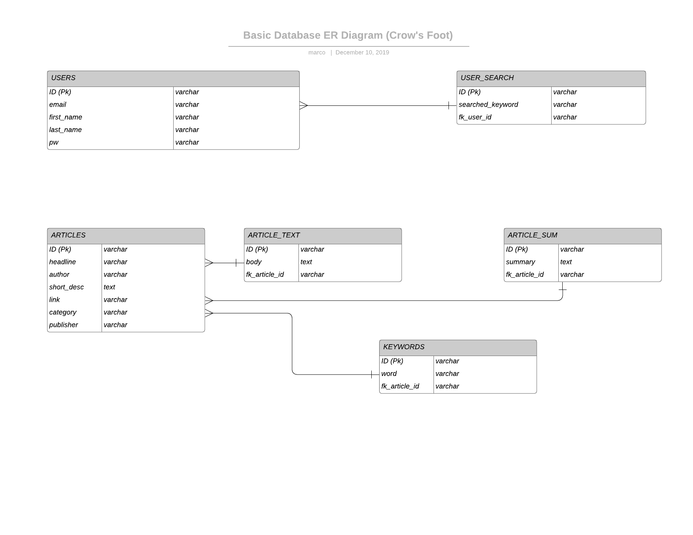

## Dataset

This [dataset](https://www.kaggle.com/rmisra/news-category-dataset) contains around 200k news headlines from the year 2012 to 2018 obtained from HuffPost. The model trained on this dataset could be used to identify tags for untracked news articles or to identify the type of language used in different news articles.

  
Data Attributes

   
  <ul>
    <li> category: Category article belongs to </li>
    <li> headline: Headline of the article </li>
    <li> authors: Person authored the article </li>
    <li> link: Link to the post </li>
    <li> short_description: Short description of the article </li>
    <li> date: Date the article was published </li>
  </ul>

  
Data Categories

  <ul>
    <li> POLITICS: 32739 </li>
    <li> WELLNESS: 17827 </li>
    <li> ENTERTAINMENT: 16058 </li>
    <li> TRAVEL: 9887 </li>
    <li> STYLE & BEAUTY: 9649 </li>
    <li> PARENTING: 8677 </li>
    <li> HEALTHY LIVING: 6694 </li>
    <li> QUEER VOICES: 6314 </li>
    <li> FOOD & DRINK: 6226 </li>
    <li> BUSINESS: 5937 </li>
    <li> COMEDY: 5175 </li>
    <li> SPORTS: 4884 </li>
    <li> BLACK VOICES: 4528 </li>
    <li> HOME & LIVING: 4195 </li>
    <li> PARENTS: 3955 </li>
    <li> THE WORLDPOST: 3664 </li>
    <li> WEDDINGS: 3651 </li>
    <li> WOMEN: 3490 </li>
    <li> IMPACT: 3459 </li>
    <li> DIVORCE: 3426 </li>
    <li> CRIME: 3405 </li>
    <li> MEDIA: 2815 </li>
    <li> WEIRD NEWS: 2670 </li>
    <li> GREEN: 2622 </li>
    <li> WORLDPOST: 2579 </li>
    <li> RELIGION: 2556 </li>
    <li> STYLE: 2254 </li>
    <li> SCIENCE: 2178 </li>
    <li> WORLD NEWS: 2177 </li>
    <li> TASTE: 2096 </li>
    <li> TECH: 2082 </li>
    <li> MONEY: 1707 </li>
    <li> ARTS: 1509 </li>
    <li> FIFTY: 1401 </li>
    <li> OOD NEWS: 1398 </li>
    <li> ARTS & CULTURE: 1339 </li>
    <li> ENVIRONMENT: 1323 </li>
    <li> COLLEGE: 1144 </li>
    <li> LATINO VOICES: 1129 </li>
    <li> CULTURE & ARTS: 1030 </li>
    <li> EDUCATION: 100 </li>
  </ul>

__Sample Dataset__

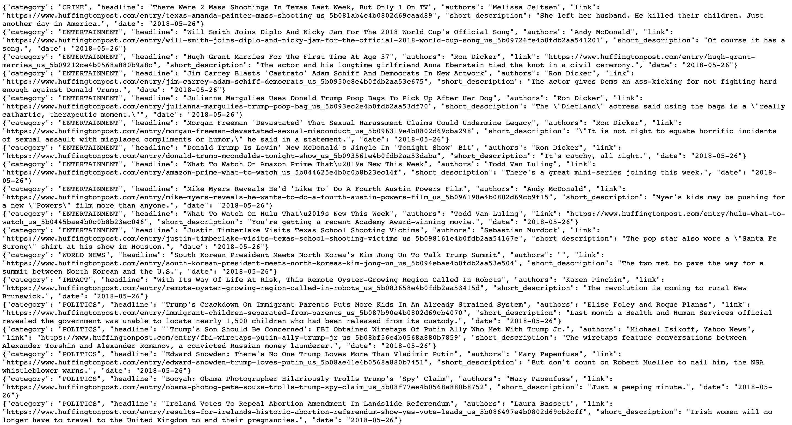

## Algorithm

- Webscrape articles
- Process/Clean text; remove stop words etc ... (Python NLTK)
- Create dictionary of the frequency of all nouns
- Select top keywords
- [Newspaper3k](https://newspaper.readthedocs.io/en/latest/)

## Demo

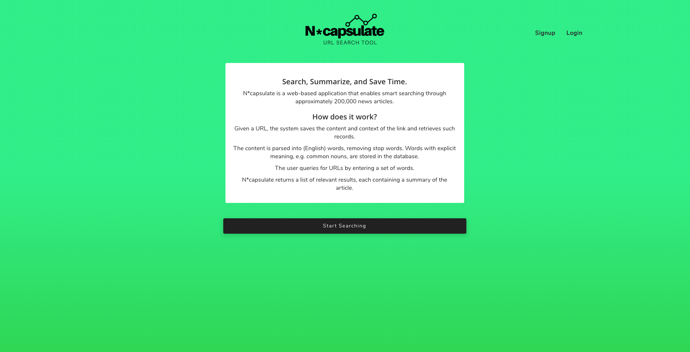
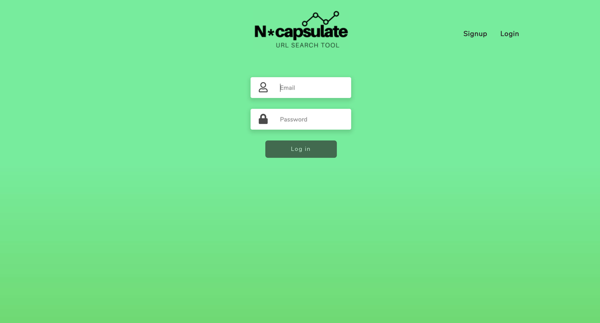
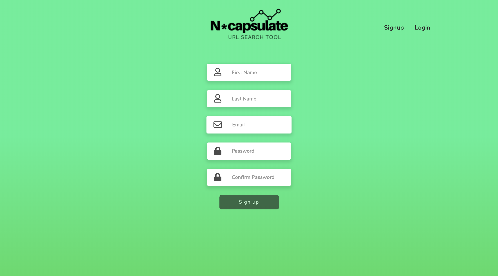
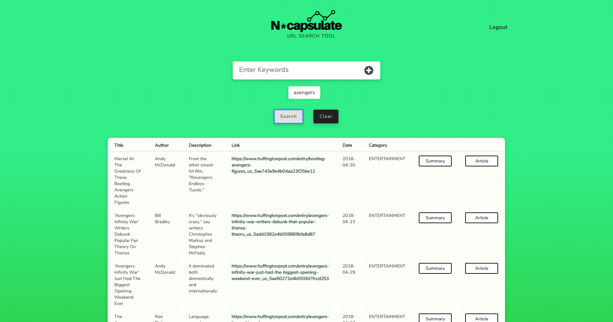
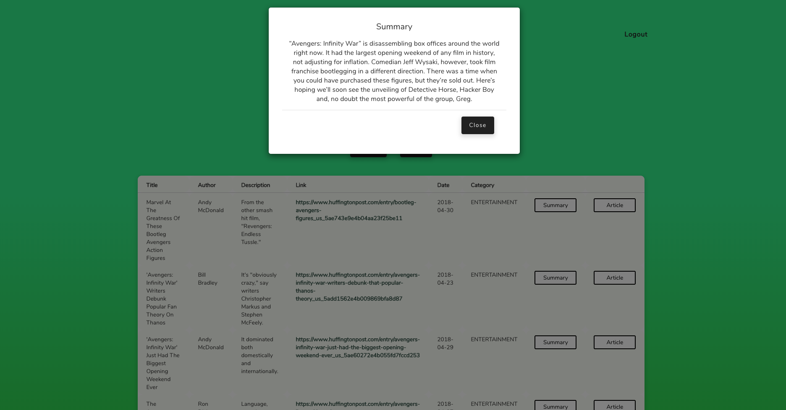
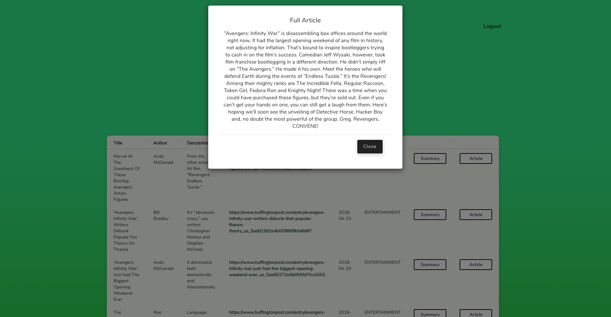

## Presentation Slides

[Slides](https://www.canva.com/design/DADtlH7TP8c/_G-C2XgUPDYJKAemAdzvkw/view?utm_content=DADtlH7TP8c&utm_campaign=designshare&utm_medium=link&utm_source=sharebutton#0)

## Contributors

Ho Ming Poon
Marco Valero
Gillian Pantaleon
Isabella Berekdar
Michael Nurilov
